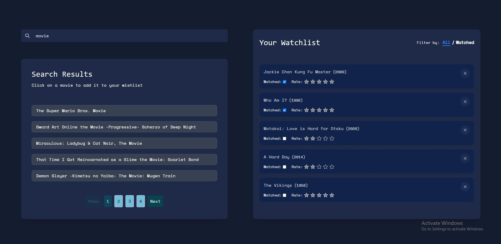

# Movie Watchlist

## Table of contents

- [Overview](#overview)
- [Screenshot](#screenshot)
- [Requirements](#requirements)
- [Technologies Used](#technologies-used)
- [Installation](#installation)
- [Usage](#usage)
- [Features](#features)
- [Contributing](#contributing)
- [Author](#author)

## Overview

Movie Watchlist is a ReactJS application that allows users to create a personalized watchlist for movies. Users can add movies to their watchlist, rate movies, mark them as watched, and search for movies to add to the watchlist. The application uses [The Movie Database API](https://developers.themoviedb.org/3/getting-started/introduction) to search for movies and retrieve movie information.

## Screenshot



## Requirements

To run this application, you need to have the following installed on your system:

- [NodeJS](https://nodejs.org/en/)
- [npm (Node Package Manager)](https://www.npmjs.com/get-npm) or [yarn](https://yarnpkg.com/)

## Technologies Used

The Movie Watchlist application is built using the following technologies:

- [ReactJS](https://reactjs.org/)
- [Vite](https://vitejs.dev/)
- [Tailwind CSS](https://tailwindcss.com/)
- [React Paginate](https://www.npmjs.com/package/react-paginate)

## Installation

1. Clone the GitHub repository to your local machine using the following command:

   ```bash
   git clone https://github.com/muzardemoses/movie-watchlist.git
   ```

2. Navigate to the project directory.

   ```bash
   cd movie-watchlist
   ```

3. Install the required dependencies using npm or yarn:

   ```bash
   npm install
   ```

   or

   ```bash
   yarn install
   ```

4. Create a `.env` file in the root directory of the project and add the following environment variables:

   ```bash
   VITE_API_KEY=YOUR_API_KEY
   ```

## Usage

After completing the installation steps, you can run the application locally with the following command:

```bash
npm run dev
```
   
or

```bash
yarn dev
```
This will start the development server, and you can access the application in your web browser at `http://localhost:5173`.

## Features

The Movie Watchlist application offers the following features:

1. Search input to search for movies by title.
2. Fetch movie data from [The Movie Database API](https://developers.themoviedb.org/3/getting-started/introduction) and display the results as the user types.
3. Pagination to display the results in pages.
4. Add movies to the watchlist from the search results.
5. Show movie titles, release years, ratings, and a checkbox to mark movies as watched in the watchlist.
6. Mark movies as watched in the watchlist by checking the checkbox.
7. Rate movies in the watchlist using a 1 to 5 star rating system.
8. Remove movies from the watchlist when they are no longer needed.
9. Implement a "Watched" filter to toggle between showing all movies and showing only watched movies.
10. Persist the watchlist in the browser's local storage.

## Contributing

Contributions are welcome. Please open an issue if you find any bugs or if you have any suggestions for improvements.
If you want to contribute, please follow these steps:

1. Fork the repository on GitHub.
2. Create a new branch with a descriptive name: git checkout -b my-new-feature.
3. Make your changes and commit them with a descriptive commit message.
4. Push your changes to your fork: git push origin my-new-feature.
5. Submit a pull request explaining your changes and their benefits.

## Author

- GitHub - [@MuzardeMoses](https://github.com/muzardeMoses)
- Frontend Mentor - [@muzardemoses](https://www.frontendmentor.io/profile/muzardemoses)
- Twitter - [@Muzarde1](https://www.twitter.com/Muzarde1)
- LinkedIn - [Moses Adebayo](https://www.linkedin.com/in/muzardemoses/)
- Instagram - [@muzardemoses](https://www.instagram.com/ademuzardemoses/)
- Facebook - [Adebayo MuzardeMoses Olaoluwa ](https://facebook.com/ademuzardemoses)
- YouTube - [MuzardeMoses](https://www.youtube.com/channel/@muzardemoses)
- Website - [MuzardeMoses](https://mosesadebayo.me/)

Thank you for checking out this project!